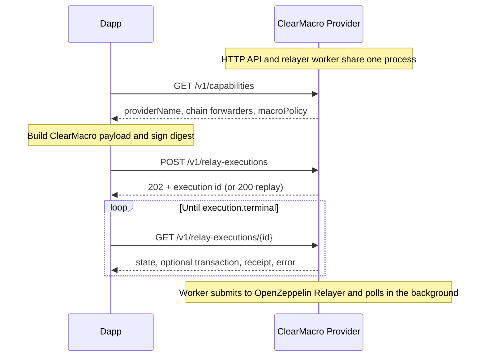

# ClearMacro Provider

TypeScript service that accepts signed **ClearMacro relay executions**, validates policy against static **provider config**, tracks lifecycle in **SQLite**, and submits transactions via **OpenZeppelin Relayer**. Provider config holds chain policy (forwarders, allowed macros, RPCs); relayer IDs are resolved at startup from the relayer API.

**Production:** https://clearmacro-provider.superfluid.dev  
**API reference:** https://clearmacro-provider.superfluid.dev/docs  
**Operations:** [`docs/operations.md`](docs/operations.md)  
**Architecture notes:** [`docs/architecture.md`](docs/architecture.md)

## What it runs

- **app:** Fastify HTTP API + relayer worker (same process)
- **oz-relayer:** transaction backend
- **redis:** OpenZeppelin Relayer repository storage

## HTTP API (v1)

Swagger at `/docs` is the API reference for request/response shapes, status codes, field descriptions, and examples.

| Method | Path                       | Purpose                                                            |
| ------ | -------------------------- | ------------------------------------------------------------------ |
| `GET`  | `/healthz`                 | Liveness                                                           |
| `GET`  | `/readyz`                  | Readiness (per-chain: RPC, relayer, signer balance)                |
| `GET`  | `/metrics`                 | Prometheus metrics                                                 |
| `GET`  | `/v1/capabilities`         | Global `providerName` + per-chain `forwarderAddress` + `macroPolicy` |
| `POST` | `/v1/relay-executions`     | Create execution (sync validate + preflight; worker submits later) |
| `GET`  | `/v1/relay-executions/:id` | Execution resource; `?include=events` for lifecycle events         |

### Dapp flow (typical)



Execution states, deduplication, status codes, errors, and request fields (including `forceExecuteAfterPreflightRevert`) are covered in the [API reference](https://clearmacro-provider.superfluid.dev/docs). For a state machine and dedup invariants, see [`docs/architecture.md`](docs/architecture.md).

## Requirements

- Node.js 24+
- pnpm 10+
- Docker + Docker Compose (for local stack / prod compose)

## Configuration

### Environment (see `.env.example`)

| Variable               | Required   | Notes                                                                                           |
| ---------------------- | ---------- | ----------------------------------------------------------------------------------------------- |
| `DATABASE_PATH`        | yes        | SQLite file path                                                                                |
| `OZ_RELAYER_URL`       | app only   | In-container relayer URL; `compose.prod.yaml` defaults to `http://oz-relayer:8080`              |
| `OZ_RELAYER_ADMIN_URL` | no         | Advanced override for admin job; default in `admin` service is `http://oz-relayer:8080`           |
| `OZ_RELAYER_API_KEY`   | yes        | Relayer API bearer                                                                              |
| `PROVIDER_CONFIG_PATH` | no         | Default `config/provider.json`                                                                  |
| `PROVIDER_NAME`        | yes        | Must match `payload.security.provider` from dapps (also returned by `GET /v1/capabilities`)     |
| `API_AUTH_ENABLED`     | no         | Default `false`                                                                                 |
| `API_CLIENTS_JSON`     | if auth on | JSON array `[{ "id", "apiTokenHash" }]` where `apiTokenHash` is SHA-256 hex of the bearer token |

### Provider Config JSON (`config/provider.json`)

Minimal v1 shape:

- `version`: `1`
- `chains[]`: `chainId`, `forwarderAddress`, **`rpcUrls`** (non-empty array of at least one URL), and `macroPolicy`.
- `macroPolicy.mode = "allowlist"` requires `allowedMacros[]` with `{ domain, address }`; `macroPolicy.mode = "open"` accepts any macro on that chain. RPCs are used for digest reads, signature checks, preflight, and readiness.

Only chains present in `chains[]` are supported; leave chains you do not relay out of the file.

**Minimal starter:** `config/provider.example.json` — copy to `config/provider.json` and replace placeholder RPCs/addresses before `pnpm run prod:init` or first run.

You can generate Superfluid-wide templates from `@superfluid-finance/metadata` with `pnpm run provider:gen:superfluid`. For production traffic, review generated chains, set `macroPolicy`, and replace public `rpcUrls` with your own RPC provider URLs.

## Forwarder ABI

On-chain calls use a **vendored** `ClearMacroForwarderV1` ABI at `src/chain/clearMacroForwarderV1.abi.ts` (no runtime dependency on `@superfluid-finance/ethereum-contracts`). After the forwarder changes in protocol-monorepo, regenerate from a local build:

```bash
# in protocol-monorepo/packages/ethereum-contracts: yarn build
PROTOCOL_MONOREPO=../protocol-monorepo pnpm run abi:sync:clear-macro-forwarder
```

When `ethereum-contracts` publishes a release that includes ClearMacro, you can switch to `import … from "@superfluid-finance/ethereum-contracts/build/bundled-abi.json"` instead of vendoring.

## Local development

```bash
pnpm install
pnpm run dev:oz-bootstrap
pnpm run stack:dev
```

`dev:oz-bootstrap` copies `config/provider.anvil.json` and `config/oz-relayer/config.example.json` when missing, creates the Anvil keystore, and generates gitignored `config/oz-relayer/networks/evm.json` for the Docker OZ relayer.

Run the API (needs `.env` with at least `DATABASE_PATH`, `OZ_*`, `PROVIDER_NAME`, and a valid `config/provider.json`):

```bash
pnpm run dev
```

Checks:

```bash
pnpm run typecheck
pnpm test
pnpm run test:e2e
pnpm run test:coverage
pnpm run build
```

## Production deployment

Production config touches three separate state planes:

1. **Bootstrap files** — `config/oz-relayer/*` generated by `prod:init` for first boot import.
2. **Live OZ state** — Redis-backed networks/relayers owned by OpenZeppelin Relayer after first boot.
3. **App runtime** — the provider app container reads `config/provider.json` and talks to OZ at `http://oz-relayer:8080`.

Host-side admin commands (`prod:init`, `prod:apply-config`, `prod:check-config`) run over SSH on the server. Day-2 reconciliation (`prod:apply-config`, `prod:check-config`) runs a Compose `admin` one-off on the internal network at `http://oz-relayer:8080` (no host OZ port publish).

1. **`.env`** from `.env.example` — set `OZ_RELAYER_API_KEY`, `PROVIDER_NAME`, relayer/redis secrets, `DATABASE_PATH`, **`OZ_RELAYER_UID` / `OZ_RELAYER_GID`** (same as `id -u` / `id -g` for the user that owns `config/oz-relayer/keys/*`; required for `compose.prod.yaml`; on POSIX, `pnpm run prod:init` fills these when missing), and if using auth, `API_CLIENTS_JSON`.
2. **`config/provider.json`** — start from `config/provider.example.json` or generate a Superfluid-wide template with `pnpm run provider:gen:superfluid`, then set `rpcUrls` and `macroPolicy` for your deployment.
3. **Bootstrap:** `pnpm run prod:init` — secrets, keystore, and `config/oz-relayer/*` bootstrap files (see `config/oz-relayer/README.md`). Top up signer gas with **`pnpm run prod:fund`** (`SIMULATE=1` first).
4. **Compose:** `docker compose -f compose.prod.yaml up -d --build`. Then **`pnpm run prod:apply-config`** to reconcile API-safe live OZ Relayer state with `provider.json` (no Redis wipe). Ensure `redis` and `oz-relayer` are up before apply.
5. **Day-2 changes:** edit `provider.json`, run **`pnpm run prod:apply-config`** (`prod:apply-config:dry-run` to preview). This handles app policy/RPC changes and existing-network relayer updates. For changes that require OZ to re-import bootstrap files, run **`scripts/prod-apply-provider-config.sh`** on the prod machine.
6. **Verify:** `GET /healthz`, `GET /readyz`, relayer `/api/v1/ready`, smoke `GET /v1/capabilities` + `POST /v1/relay-executions` on a test chain.

See [docs/operations.md](docs/operations.md) for the full config lifecycle and readiness runbook.

Operational notes: keep Redis persistence for the relayer; back up **both** app SQLite and Redis volumes; run **one** app instance per SQLite file (single worker design). See [`docs/operations.md`](docs/operations.md) for the deployment checklist and readiness runbook.
