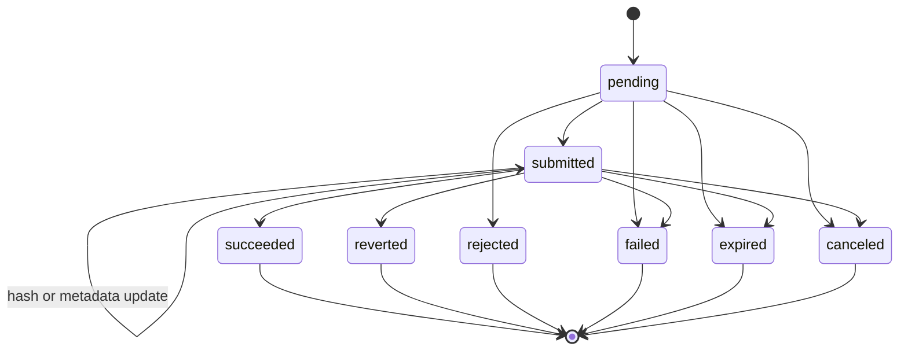

# Architecture Notes

This document captures maintainer-facing invariants that are easy to lose when only reading endpoint handlers. API field-level documentation lives in the Swagger UI at `/docs`.

## Runtime Model

The app accepts signed ClearMacro relay executions, stores them in SQLite, and lets a background worker submit and reconcile transactions through OpenZeppelin Relayer. The app does not allocate EVM nonces, sign transactions, or implement raw transaction replacement logic; those are relayer responsibilities.

Provider config contains app policy only: configured chains, ClearMacro forwarders, app RPC URLs, and macro policy. OpenZeppelin Relayer IDs are discovered at startup by querying the relayer API and matching configured chain IDs.

## Public API Boundary

The public API exposes stable provider execution resources. It intentionally does not expose:

- OpenZeppelin Relayer IDs or transaction IDs.
- Raw OpenZeppelin Relayer statuses or response JSON.
- Full transaction hash history.
- Raw payloads, signatures, or internal audit logs.
- Macro allowlists or whether a chain is in open policy mode.

`GET /v1/capabilities` only returns the deployment `providerName` and configured chain forwarders. Request-time policy remains enforced by `POST /v1/relay-executions`.

## Execution Identity

Dapps should track the provider execution `id`. The EVM transaction hash is optional metadata:

- `pending`: execution accepted, no current transaction hash is required.
- `submitted`: a current transaction hash is known.
- `succeeded`, `reverted`, `rejected`, `failed`, `expired`, and `canceled`: terminal states.

Transaction hash replacement updates metadata while the execution remains non-terminal. Do not introduce public behavior that requires dapps to reason about OpenZeppelin Relayer internals.

### Public state machine

Allowed transitions match `src/tx/lifecycle.ts`. Terminal states do not transition further.



## Create Flow Invariants

`POST /v1/relay-executions` performs synchronous validation before creating an execution:

1. Validate request shape and auth.
2. Resolve the forwarder from provider config.
3. Decode ClearMacro payload.
4. Enforce provider name, macro address consistency, validity window, macro policy, and readiness.
5. Read the forwarder digest and validate the signature.
6. Run preflight simulation.
7. Persist a `pending` execution only after validation passes, or after deterministic preflight revert only when `forceExecuteAfterPreflightRevert` is explicitly true.

Synchronous validation failures do not create public execution resources. They should still write internal audit rows when enough context is available.

## Deduplication

Deduplication is based on the exact signed authorization intent:

```text
(chainId, forwarderAddress, signerAddress, digest)
```

The digest is read from `ClearMacroForwarderV1.getDigest(macroAddress, payload)`. Deduplication is a retry and UX feature, not replay protection; onchain replay protection remains the forwarder's responsibility.

Important invariant: duplicate replay must not become an authorization bypass. A caller should only receive an existing execution when the request is otherwise valid and the execution is visible to that caller. With auth enabled, visibility means the same resolved `client_id`; a different `client_id` gets `409 DUPLICATE_EXECUTION` without leaking the existing execution ID. With auth disabled, all callers are `anonymous`, so exact duplicate replays return the existing execution.

## Registry Macro Policy

Every configured chain uses an explicit `macroPolicy`:

- `allowlist`: require an exact decoded `(domain, macroAddress)` match in `allowedMacros`.
- `open`: skip allowlist membership only.

Open mode still validates chain config, resolved forwarder, request/payload macro consistency, provider name, digest, signature, readiness, and preflight. Empty `allowedMacros` must not mean open mode.

## Worker Ownership

The worker owns post-creation progress:

- Select `pending` executions without an OpenZeppelin transaction ID.
- Re-check expiry and optional safety preflight.
- Submit the transaction intent to OpenZeppelin Relayer.
- Store the OpenZeppelin transaction ID internally.
- Poll OpenZeppelin Relayer and project status into the public execution state.

Transient submit or poll failures should not corrupt public state. Terminal public states should not be silently rewritten; contradictory later evidence belongs in audit/ops handling.
