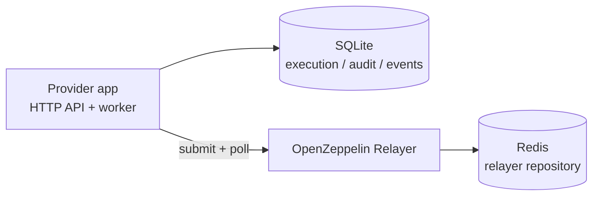

# Operations

This service normally runs as three components:

- **app:** Fastify API and relayer worker.
- **oz-relayer:** OpenZeppelin Relayer transaction backend.
- **redis:** OpenZeppelin Relayer repository storage.

The app stores relay execution state in SQLite. OpenZeppelin Relayer stores transaction backend state in Redis. Back up both.

## Runtime Topology



## Local Development

```bash
pnpm install
pnpm run dev:oz-bootstrap
pnpm run stack:dev
pnpm run dev
```

`dev:oz-bootstrap` generates gitignored `config/oz-relayer/networks/evm.json` and `config.json` from the Anvil examples; production uses `prod:init` / `prod:apply-config` instead.

The app reads `.env`. Required variables include `DATABASE_PATH`, `OZ_RELAYER_API_KEY`, and `PROVIDER_NAME`. Inside `compose.prod.yaml`, the app uses `OZ_RELAYER_URL` defaulting to `http://oz-relayer:8080`. Production admin commands (`prod:apply-config`, `prod:check-config`) are invoked from the host but execute in a one-off Compose `admin` container on the same network (`http://oz-relayer:8080`); the OZ relayer is not published to host ports. If API auth is enabled, set `API_AUTH_ENABLED=true` and `API_CLIENTS_JSON`.

Optional Safe message authorization (`safeMessageV1` for `clearMacroV1`): set `SAFE_API_KEY` in the host `.env` to enable (omit the key to leave it off). `compose.prod.yaml` forwards that key and the related Safe knobs into the app container — host `.env` alone is not enough unless those compose entries exist. Use `SAFE_AUTHORIZATION_ENABLED=false` as a kill switch while keeping the key configured; `true` without a key is rejected at startup. Poll/retry knobs and optional `SAFE_TX_SERVICE_URL` are documented in `.env.example`. When enabled, capabilities list `safeMessageV1` alongside the default `signature` in `supportedAuthorizationMethods`, and executions can sit in `awaiting_authorization` until the authorization worker promotes them.

Useful checks:

```bash
pnpm run typecheck
pnpm test
pnpm run test:e2e
pnpm run build
```

The Docker stack E2E is intentionally opt-in:

```bash
pnpm run test:e2e:stack
```

It requires Docker, Docker Compose v2, Foundry, and local Anvil/OZ relayer fixture setup.

## Production Deployment

Production config has three state planes:

| Plane | Owner | Updated by |
|-------|-------|------------|
| Bootstrap files (`config/oz-relayer/*`) | Host filesystem | `prod:init`, then `prod:up` / `prod:apply-config` (audit copy) |
| Live OZ networks/relayers | Redis via OZ API | `prod:up` / `prod:apply-config` |
| App policy (`config/provider.json`) | App container | Edit file + `prod:up` |

All admin commands run on the host over SSH. The app and the `admin` job both talk to OZ at `http://oz-relayer:8080` on the Compose network. Do not publish OZ admin ports to the host to fix script access; use `pnpm run prod:apply-config` / `prod:check-config` instead.

1. Create production `.env` from `.env.example`.
2. Set `PROVIDER_NAME`; `pnpm run prod:init` fills generated relayer/Redis secrets and `OZ_RELAYER_UID` / `OZ_RELAYER_GID` when missing on POSIX systems.
3. Do not set `DATABASE_PATH` for production Compose; `compose.prod.yaml` uses `/data/clearmacro-provider.sqlite`.
4. Provide `config/provider.json` from a checked-in example or generated Superfluid template, then set production RPC URLs and `macroPolicy`.
5. Run **`pnpm run prod:init`** once to generate secrets, keystore, and bootstrap `config/oz-relayer/*` files.
6. Fund the signer on every configured chain (`SIMULATE=1 pnpm run prod:fund`, then `pnpm run prod:fund`, or fund manually).
7. Run **`pnpm run prod:up`** to validate, start Redis/OZ, verify/import live OZ state, start the app, and run checks.

At startup, the app queries OpenZeppelin Relayer and binds exactly one active relayer per configured `chainId`. Missing or ambiguous relayer matches fail startup by design.

## Config lifecycle (day 2)

`config/provider.json` is the single source of truth for supported chains, forwarders, app RPCs, and macro policy.

| Change | Command |
|--------|---------|
| First-time bootstrap | `pnpm run prod:init`, fund signer, then `pnpm run prod:up` |
| Any later config change | Edit `provider.json`, then `pnpm run prod:up` |
| Full production check | `pnpm run prod:check` |
| Preview config apply actions | `pnpm run prod:apply-config:dry-run` |
| Check live vs desired drift | `pnpm run prod:check-config` |
| Verify live OZ import before starting app | `pnpm run prod:verify-oz-import` |
| Validate local prod config files, generated OZ files, and signer balances | `pnpm run prod:validate` |

**`prod:init`** is idempotent bootstrap only: it does not rotate secrets or apply changes to live Redis-backed OZ state after first boot.

**`prod:validate`** checks local files only (env, generated `config/oz-relayer/*`, signer balances). It does **not** query live OZ Redis/API state.

**`prod:verify-oz-import`** is the explicit live OZ gate: for every chain in `provider.json`, it `GET`s the expected network and relayer directly (not paginated list endpoints), prints precise mismatches (missing network, wrong `chain_id`, RPC drift, paused/`system_disabled` relayer), then runs the same relayer binding check the app performs at startup. Run this after `redis` + `oz-relayer` are up and **before** starting/restarting `app`.

**`prod:apply-config`** reconciles the API-safe parts of live OZ state via the internal admin API: patch existing network RPC URLs, create/update relayers for existing networks, optionally pause removed relayers, validate relayer binding, update bootstrap files for audit, then the host wrapper restarts the app (unless `--no-restart-app`, which is host-only and not passed into the admin container). Its dry run previews the planned live OZ mutations and generated-file updates without applying them. Requires `redis` and `oz-relayer` to be running; runs the `admin` Compose profile job against `http://oz-relayer:8080`. If apply fails with a connection error, check `docker compose -f compose.prod.yaml ps` and `logs oz-relayer`.

- **Macro policy / app RPCs:** carried in `provider.json`; app restart loads them. No Redis wipe.
- **OZ RPCs:** `networks/evm.json` uses the `rpcUrls` entries from `provider.json` as the operator-curated RPC list. Keep every listed URL production-grade; bad public fallbacks can make OZ system-disable relayers during health checks.
- **Add chain:** if the OZ network already exists, `prod:apply-config` can create/update the relayer. If the OZ network is missing, the command stops with `bootstrap_required`; OZ v1.4 imports new networks from bootstrap files, not from a live create-network API. Regenerate `config/oz-relayer/networks/evm.json` and run the OZ Redis re-import/maintenance workflow for that change.
- **Remove chain:** app stops serving the chain after restart; OZ relayers are left as-is by default. Use `--pause-removed-relayers` to pause orphans.
- **Emergency reset:** `docker compose -f compose.prod.yaml down` and remove volume `clearmacro-provider_oz-redis-data` only for pre-prod or break-glass (drops in-flight relayer queue state). Do not use `RESET_STORAGE_ON_START=true` in normal operations.

## Relayer signer gas

The OpenZeppelin Relayer signer must hold native gas on every chain in `config/provider.json`.

- **Check balances:** `pnpm run prod:validate` (validates local prod files/env, confirms generated OZ files match `provider.json`, and prints per-chain signer balance from provider RPCs).
- **Top up:** `pnpm run prod:fund` — per-chain `fundingTxCount` from **30d Superfluid `flowUpdatedEvents`** (subgraph), scaled vs the median chain (`FUNDING_BASE_TX_COUNT`, default `30`). Provider SQLite relay history overrides subgraph when present. Use `SIMULATE=1` first. Flat mode: `TARGET_TX_COUNT=30`. Filters: `CHAIN_IDS`, `TESTNET_ONLY=1`, `MAINNET_ONLY=1`.
- **Metrics:** on `GET /metrics`, sampled every `RELAYER_SIGNER_BALANCE_SAMPLE_INTERVAL_MS` (default 60 minutes; `0` disables):
  - `clearmacro_relayer_signer_balance_native{chain_id,network}` — latest native-token balance
  - `clearmacro_relayer_signer_balance_probe_success{chain_id,network}` — `1` if the last sample succeeded
  - `clearmacro_relayer_signer_balance_last_update_timestamp_seconds{chain_id,network}` — last successful sample time (alert if stale)
- **Alerting:** Gate low-balance alerts on `clearmacro_relayer_signer_balance_probe_success == 1` so a failed RPC/OZ sample is not mistaken for an empty wallet. Treat data as stale when `time() - clearmacro_relayer_signer_balance_last_update_timestamp_seconds` exceeds roughly two sample intervals (default ~2 hours at the 60-minute interval). Readiness and relay traffic still catch zero balance on admission; these metrics are for coarse monitoring between samples.

## Actionable failure metrics

The app exposes counters for operator-actionable failures and non-terminal operational retries. These are **not** deployed as Alertmanager rules by default; ops wires them separately.

### Counters

| Metric | Labels | When incremented |
|--------|--------|------------------|
| `clearmacro_actionable_failures_total` | `chain_id`, `stage`, `code` | Once per decided actionable failure (admission error, terminal worker/auth outcome, worker tick exception) |
| `clearmacro_operational_retries_total` | `chain_id`, `stage`, `reason` | When a worker/auth path schedules another retry for an operational stall |

`stage` values: `admission`, `worker_submit`, `worker_poll`, `authorization`, `worker_tick`.

Operational retry `reason` values: `preflight_rpc_unavailable`, `chain_rpc_unavailable`, `relayer_unavailable`, `relayer_poll_error`, `relayer_poll_rate_limited`, `safe_api_retryable`, `unknown`.

Use `chain_id="unknown"` only when no chain context exists (worker tick failures).

### Taxonomy (actionable vs expected)

**Actionable** (increment `clearmacro_actionable_failures_total`):

- Admission: `PROVIDER_NOT_READY`, `RELAYER_UNAVAILABLE`, `CHAIN_UNAVAILABLE`
- Admission (metered, see catch-all below): `RELAYER_RATE_LIMITED`
- Worker submit: `RELAYER_SUBMIT_FAILED`, `INTERNAL_INVARIANT`, `INVALID_PERMIT2_STATE`, `CHAIN_NOT_ALLOWED`
- Worker poll: `RELAYER_FAILED`
- Authorization: `INVALID_AUTHORIZATION_STATE`, non-retryable Safe infra (e.g. `SAFE_API_UNAUTHORIZED`)
- Worker tick: `RELAYER_WORKER_TICK_FAILED`, `AUTHORIZATION_WORKER_TICK_FAILED`

**Expected** (do **not** increment): client validation rejects (`SIGNATURE_INVALID`, admission `PREFLIGHT_REVERTED`, policy rejects), ordinary terminal `reverted` (`ONCHAIN_REVERTED`, `RELAYER_REPORTED_REVERT`), `SAFE_AUTHORIZATION_UNSUPPORTED`, duplicate/expired/canceled outcomes.

`RELAYER_RATE_LIMITED` is still metered on the actionable counter for investigation, but **exclude** it from the catch-all alert (use a sustained-threshold rule instead).

### Example PromQL (documented — not deployed until ops adds rules)

```yaml
# Catch-all actionable failures, excluding rate-limit blips
- alert: ClearMacroActionableFailure
  expr: increase(clearmacro_actionable_failures_total{code!="RELAYER_RATE_LIMITED"}[5m]) > 0

# Sustained OZ rate limiting
- alert: ClearMacroRelayerRateLimited
  expr: |
    increase(clearmacro_actionable_failures_total{code="RELAYER_RATE_LIMITED"}[10m]) > 3
    or increase(clearmacro_operational_retries_total{reason="relayer_poll_rate_limited"}[10m]) > 3
  for: 5m

# Sustained non-terminal retries
- alert: ClearMacroOperationalRetries
  expr: sum by (chain_id, stage, reason) (increase(clearmacro_operational_retries_total[15m])) > 5
  for: 10m
```

Process liveness (`up == 0` / scrape failure) remains an infra concern outside these counters.

## Dashboard / golden-signals metrics

Complementary counters and gauges for Grafana traffic, funnel, readiness, and stall visibility. These do **not** replace the actionable-failure paging contract above.

### Metrics

| Metric | Labels | Purpose |
|--------|--------|---------|
| `clearmacro_requests_total` | `chain_id`, `kind`, `result` | One increment per schema-valid `POST /v1/relay-executions` handler invocation |
| `clearmacro_validation_failures_total` | `chain_id`, `code` | Expected client-facing validation codes only |
| `clearmacro_relayer_submission_total` | `chain_id`, `outcome` | Worker submit funnel: `accepted`, `retry`, `failed` |
| `clearmacro_relayer_poll_duration_seconds` | `chain_id` | OZ status poll latency histogram |
| `clearmacro_readiness` | `chain_id`, `reason` | Proactive readiness gauge (`1` when ready with `reason="none"`) |
| `clearmacro_executions_terminal_total` | `chain_id`, `state`, `code` | Nonterminal→terminal transitions (API + workers) |
| `clearmacro_oldest_nonterminal_execution_age_seconds` | `chain_id`, `state` | Oldest execution age for `awaiting_authorization`, `pending`, `submitted` |

Request `result` values: `created`, `duplicate`, `rejected_client`, `rejected_provider`, `error`.

Readiness sampler env: `READINESS_METRICS_INTERVAL_MS` (default `30000`, `0` disables). Oldest-age sampler env: `OLDEST_NONTERMINAL_AGE_INTERVAL_MS` (default `30000`, `0` disables). Both run once immediately at startup, sequentially per chain, with no overlapping ticks.

The readiness sampler reuses the cached `GET /readyz` evaluator and **removes stale `{chain_id, reason}` labelsets** before setting the current reason so old not-ready series do not linger.

### Suggested Grafana panels

1. Request rate by `result` / `chain_id`
2. Admit success ratio: `(created+duplicate) / all requests`
3. Validation failures by `code`
4. Actionable failures + operational retries (alerting metrics above)
5. Submission outcomes by `outcome`
6. Poll latency p50/p95 by chain: `histogram_quantile(0.95, sum by (chain_id, le) (rate(clearmacro_relayer_poll_duration_seconds_bucket[5m])))`
7. Readiness by chain: `clearmacro_readiness`
8. Terminal outcomes by `state`
9. Oldest non-terminal execution age by `state`
10. Existing relayer signer balance panels

Example PromQL snippets:

```promql
# Request rate by result
sum by (chain_id, result) (rate(clearmacro_requests_total[5m]))

# Admit success ratio
sum(rate(clearmacro_requests_total{result=~"created|duplicate"}[5m]))
/
sum(rate(clearmacro_requests_total[5m]))

# Terminal outcomes
sum by (chain_id, state) (rate(clearmacro_executions_terminal_total[5m]))
```

### Soft alerts (ops follow-up — requires readiness stale-series cleanup)

```yaml
- alert: ClearMacroChainNotReady
  expr: clearmacro_readiness{reason!="none"} == 0
  for: 10m
  labels: { severity: warning }

- alert: ClearMacroExecutionStuck
  expr: max by (chain_id, state) (clearmacro_oldest_nonterminal_execution_age_seconds) > 1800
  for: 10m
  labels: { severity: warning }
```

Do not page on validation-volume spikes by default.

## Verification

After deployment:

```bash
curl -fsS https://clearmacro-provider.superfluid.dev/healthz
curl -fsS https://clearmacro-provider.superfluid.dev/readyz
curl -fsS https://clearmacro-provider.superfluid.dev/v1/capabilities
```

For a full smoke test, submit a controlled `POST /v1/relay-executions` on a test chain and poll the returned execution until it is terminal.

## Data And Backups

- Back up the app SQLite database. It contains relay executions, audit rows, lifecycle events, and app-side relayer snapshots.
- Back up Redis. It contains OpenZeppelin Relayer transaction backend state.
- Do not run multiple app workers against the same SQLite file. The current deployment model is one app instance per SQLite database.

## Readiness Runbook

`GET /healthz` only confirms the process is running. `GET /readyz` is stricter: it checks configured chains, app RPCs, relayer binding, OpenZeppelin Relayer readiness, and signer balance.

If `readyz` returns `503`:

- `PROVIDER_NOT_READY` usually means local provider dependencies are not ready, such as signer balance or app RPC access.
- `RELAYER_UNAVAILABLE` means the relayer is down, paused, misconfigured, unreachable, or returned an unexpected failure.
- `RELAYER_RATE_LIMITED` means OpenZeppelin Relayer returned HTTP 429 after bounded retries.

Short rate-limit bursts are operationally different from a hard relayer outage. Check OpenZeppelin Relayer logs and metrics before changing provider config. In production, keep relayer HTTP access private, use finite rate limits, and size those limits from observed provider readiness and worker traffic.
