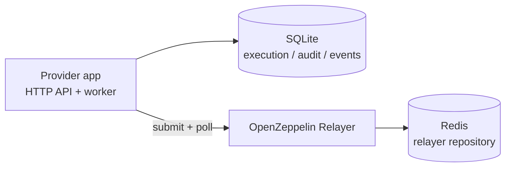

# Operations

This service normally runs as three components:

- **app:** Fastify API and relayer worker.
- **oz-relayer:** OpenZeppelin Relayer transaction backend.
- **redis:** OpenZeppelin Relayer repository storage.

The app stores relay execution state in SQLite. OpenZeppelin Relayer stores transaction backend state in Redis. Back up both.

## Runtime Topology



## Local Development

```bash
pnpm install
pnpm run dev:oz-bootstrap
pnpm run stack:dev
pnpm run dev
```

`dev:oz-bootstrap` generates gitignored `config/oz-relayer/networks/evm.json` and `config.json` from the Anvil examples; production uses `prod:init` / `prod:apply-config` instead.

The app reads `.env`. Required variables include `DATABASE_PATH`, `OZ_RELAYER_API_KEY`, and `PROVIDER_NAME`. Inside `compose.prod.yaml`, the app uses `OZ_RELAYER_URL` defaulting to `http://oz-relayer:8080`. Host-side ops scripts (`prod:apply-config`, `prod:check-config`) use `OZ_RELAYER_ADMIN_URL` when set, otherwise `http://localhost:${OZ_RELAYER_HOST_PORT:-8080}`; `compose.prod.yaml` binds the relayer API to `127.0.0.1` only. If API auth is enabled, set `API_AUTH_ENABLED=true` and `API_CLIENTS_JSON`.

Useful checks:

```bash
pnpm run typecheck
pnpm test
pnpm run test:e2e
pnpm run build
```

The Docker stack E2E is intentionally opt-in:

```bash
pnpm run test:e2e:stack
```

It requires Docker, Docker Compose v2, Foundry, and local Anvil/OZ relayer fixture setup.

## Production Deployment

Production config has three state planes:

| Plane | Owner | Updated by |
|-------|-------|------------|
| Bootstrap files (`config/oz-relayer/*`) | Host filesystem | `prod:init`, then `prod:apply-config` (audit copy) |
| Live OZ networks/relayers | Redis via OZ API | `prod:apply-config` |
| App policy (`config/provider.json`) | App container | Edit file + app restart via `prod:apply-config` |

All admin commands run on the host over SSH. The app container talks to OZ at `http://oz-relayer:8080`; host admin scripts talk to `127.0.0.1:${OZ_RELAYER_HOST_PORT:-8080}` (or `OZ_RELAYER_ADMIN_URL`).

1. Create production `.env` from `.env.example`.
2. Set `OZ_RELAYER_API_KEY`, `PROVIDER_NAME`, relayer and Redis secrets, and `DATABASE_PATH`.
3. Set `OZ_RELAYER_UID` and `OZ_RELAYER_GID` to the numeric owner of `config/oz-relayer/keys/*`; `pnpm run prod:init` fills these when missing on POSIX systems.
4. Provide `config/provider.json` from a checked-in example or generated Superfluid template, then set production RPC URLs and `macroPolicy`.
5. Run **`pnpm run prod:init`** once to generate secrets, keystore, and bootstrap `config/oz-relayer/*` files.
6. Start with `docker compose -f compose.prod.yaml up -d --build` or `pnpm run stack:prod` (first boot with empty Redis imports OZ bootstrap files).
7. Run **`pnpm run prod:apply-config`** so live OZ Relayer state matches `provider.json` (required after the first boot if Redis already had state). If the admin API is unreachable, start `redis` and `oz-relayer` first.

At startup, the app queries OpenZeppelin Relayer and binds exactly one active relayer per configured `chainId`. Missing or ambiguous relayer matches fail startup by design.

## Config lifecycle (day 2)

`config/provider.json` is the single source of truth for supported chains, forwarders, app RPCs, and macro policy.

| Change | Command |
|--------|---------|
| First-time bootstrap | `pnpm run prod:init` then `docker compose -f compose.prod.yaml up -d --build` |
| Any later config change | Edit `provider.json`, then `pnpm run prod:apply-config` |
| Preview config apply actions | `pnpm run prod:apply-config:dry-run` |
| Check live vs desired drift | `pnpm run prod:check-config` |
| Validate local prod config files, generated OZ files, and signer balances | `pnpm run prod:validate` |

**`prod:init`** is idempotent bootstrap only: it does not rotate secrets or apply changes to live Redis-backed OZ state after first boot.

**`prod:apply-config`** reconciles live OZ state via the host admin API (create/patch networks and relayers, update submission RPC URLs) without wiping Redis, updates bootstrap files for audit, validates relayer binding, and restarts the app (unless `--no-restart-app`). Its dry run previews the planned live OZ mutations and generated-file updates without applying them. Requires `redis` and `oz-relayer` to be running; defaults to `http://localhost:${OZ_RELAYER_HOST_PORT:-8080}`.

- **Macro policy / app RPCs:** carried in `provider.json`; app restart loads them. No Redis wipe.
- **Add chain:** `prod:apply-config` creates OZ network + relayer when missing.
- **Remove chain:** app stops serving the chain after restart; OZ relayers are left as-is by default. Use `--pause-removed-relayers` to pause orphans.
- **Emergency reset:** `docker compose -f compose.prod.yaml down` and remove volume `clearmacro-provider_oz-redis-data` only for pre-prod or break-glass (drops in-flight relayer queue state). Do not use `RESET_STORAGE_ON_START=true` in normal operations.

## Relayer signer gas

The OpenZeppelin Relayer signer must hold native gas on every chain in `config/provider.json`.

- **Check balances:** `pnpm run prod:validate` (validates local prod files/env, confirms generated OZ files match `provider.json`, and prints per-chain signer balance from provider RPCs).
- **Top up:** `pnpm run prod:fund` — per-chain `fundingTxCount` from **30d Superfluid `flowUpdatedEvents`** (subgraph), scaled vs the median chain (`FUNDING_BASE_TX_COUNT`, default `30`). Provider SQLite relay history overrides subgraph when present. Use `SIMULATE=1` first. Flat mode: `TARGET_TX_COUNT=30`. Filters: `CHAIN_IDS`, `TESTNET_ONLY=1`, `MAINNET_ONLY=1`.
- **Metrics:** on `GET /metrics`, sampled every `RELAYER_SIGNER_BALANCE_SAMPLE_INTERVAL_MS` (default 60 minutes; `0` disables):
  - `clearmacro_relayer_signer_balance_native{chain_id}` — latest native-token balance
  - `clearmacro_relayer_signer_balance_probe_success{chain_id}` — `1` if the last sample succeeded
  - `clearmacro_relayer_signer_balance_last_update_timestamp_seconds{chain_id}` — last successful sample time (alert if stale)
- **Alerting:** Gate low-balance alerts on `clearmacro_relayer_signer_balance_probe_success == 1` so a failed RPC/OZ sample is not mistaken for an empty wallet. Treat data as stale when `time() - clearmacro_relayer_signer_balance_last_update_timestamp_seconds` exceeds roughly two sample intervals (default ~2 hours at the 60-minute interval). Readiness and relay traffic still catch zero balance on admission; these metrics are for coarse monitoring between samples.

## Verification

After deployment:

```bash
curl -fsS https://clearmacro-provider.superfluid.dev/healthz
curl -fsS https://clearmacro-provider.superfluid.dev/readyz
curl -fsS https://clearmacro-provider.superfluid.dev/v1/capabilities
```

For a full smoke test, submit a controlled `POST /v1/relay-executions` on a test chain and poll the returned execution until it is terminal.

## Data And Backups

- Back up the app SQLite database. It contains relay executions, audit rows, lifecycle events, and app-side relayer snapshots.
- Back up Redis. It contains OpenZeppelin Relayer transaction backend state.
- Do not run multiple app workers against the same SQLite file. The current deployment model is one app instance per SQLite database.

## Readiness Runbook

`GET /healthz` only confirms the process is running. `GET /readyz` is stricter: it checks configured chains, app RPCs, relayer binding, OpenZeppelin Relayer readiness, and signer balance.

If `readyz` returns `503`:

- `PROVIDER_NOT_READY` usually means local provider dependencies are not ready, such as signer balance or app RPC access.
- `RELAYER_UNAVAILABLE` means the relayer is down, paused, misconfigured, unreachable, or returned an unexpected failure.
- `RELAYER_RATE_LIMITED` means OpenZeppelin Relayer returned HTTP 429 after bounded retries.

Short rate-limit bursts are operationally different from a hard relayer outage. Check OpenZeppelin Relayer logs and metrics before changing provider config. In production, keep relayer HTTP access private, use finite rate limits, and size those limits from observed provider readiness and worker traffic.
