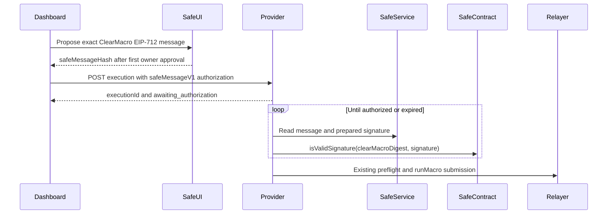

> **Iteration plan** — frozen 2026-07-10. Not maintained after ship.
> Current docs: [clearmacro-provider README](../../README.md) and [Dashboard ClearMacro integration plan](https://github.com/superfluid-finance/dashboard/blob/master/docs/plans/clear-macro-relay-integration.md)

# Safe Message Relay Plan

## Goal

Allow an app to register a complete ClearMacro intent for a Safe before its threshold authorization is complete. The provider survives browser closure/restarts, waits for Safe Message authorization, and relays the existing `runMacro` call once the Safe validates the ClearMacro digest.

The Safe API key only authenticates infrastructure access; it cannot replace an owner signature. Dashboard must therefore use its existing Safe Apps session to propose the message before registering the provider execution.

## Constraints and non-goals

- Keep `POST /v1/relay-executions` and `kind: "clearMacroV1"`; Safe is an authorization method, not a new transaction kind or separate intent resource.
- Preserve the current top-level `signature` request as a backwards-compatible shorthand for `{ type: "signature" }`.
- Do not support Safe authorization for `clearMacroPermit2V1` in this iteration.
- Initially support top-level Safes whose threshold can be satisfied by EOA owners. Detect contract/nested owners and return a clear unsupported state; do not hand-roll recursive Safe signature packing.
- Do not expose the Safe API key, raw Safe responses, owner signatures, or provider internals publicly.
- Do not infer authorization from confirmation count. Only Safe's onchain ERC-1271 magic value authorizes execution.

## Provider implementation

1. Extend the API contract in [schemas.ts](../../src/api/schemas.ts), [canonicalBody.ts](../../src/api/canonicalBody.ts), and [routes.ts](../../src/api/routes.ts):
   - Accept either the existing `signature`, or `authorization: { type: "safeMessageV1", safeMessageHash: bytes32 }` for `clearMacroV1`.
   - Make these mutually exclusive and forbid Safe authorization with Permit2.
   - Add `awaiting_authorization` to the public execution states and return sanitized authorization progress plus a Safe message link.
   - Advertise `safeMessageV1` in capabilities only for configured chains.
2. Split admission in [admitRelayExecution.ts](../../src/api/admitRelayExecution.ts):
   - Reuse chain, payload, macro policy, validity, readiness, digest, dedup, and client-visibility checks.
   - Existing signatures still validate and preflight synchronously before entering `pending`.
   - Safe message requests verify the signer has contract code, persist immediately as `awaiting_authorization`, and defer signature validation/preflight.
   - Keep dedup keyed by `(chainId, forwarderAddress, signerAddress, digest)` so retries return the same execution.
3. Add migration `003_safe_message_authorization` and repository operations in [migrations.ts](../../src/db/migrations.ts) and [repositories.ts](../../src/db/repositories.ts):
   - Make the final execution signature nullable while awaiting authorization.
   - Persist authorization type, `safeMessageHash`, poll timestamps/backoff/error metadata, and final signature source.
   - Add an indexed query for due `awaiting_authorization` rows.
   - Atomically store the validated signature and transition to `pending` to remain restart-safe.
4. Extend [lifecycle.ts](../../src/tx/lifecycle.ts):
   - `awaiting_authorization -> pending | expired | rejected | failed | canceled`.
   - Treat transient Safe API/RPC failures as retryable state, not public terminal failure.
5. Add a server-only Safe client under `src/safe/` using `@safe-global/api-kit` with `SAFE_API_KEY`, per-chain service resolution, request timeout, bounded exponential backoff, and explicit handling for 404/401/429/5xx.
   - Fetch the Safe Message by `safeMessageHash`.
   - Verify the response Safe equals `signerAddress` and hash the returned original EIP-712 message to ensure it equals the forwarder's stored ClearMacro digest.
   - For EOA-owner Safes, consume `preparedSignature` unchanged; reject nested/contract-owner configurations as unsupported in v1.
6. Add an authorization phase before existing submission in [worker.ts](../../src/relayer/worker.ts):
   - Expire rows at `validBefore`.
   - Poll the Safe service when due; remain waiting when absent/incomplete.
   - Also try `isValidSignature(digest, "0x")` so an onchain-approved Safe message can become executable without a prepared offchain signature.
   - For a candidate prepared signature, call the existing `validateRelaySignature`; remain waiting if it is not yet valid.
   - Once valid, run the existing `runMacro` preflight with that exact signature, then atomically promote to `pending`; the OZ relayer path remains unchanged.
7. Wire configuration, dependencies, logging, readiness, and metrics through [env.ts](../../src/config/env.ts), [deps.ts](../../src/api/deps.ts), [main.ts](../../src/main.ts), `.env.example`, and [metrics.ts](../../src/metrics/metrics.ts). The Safe key remains server-only and is required only when Safe authorization is enabled.

## Dashboard implementation

1. Refactor the generic payload and EIP-712 assembly out of `dashboard/src/features/clearMacro/executeClearMacro.ts` so EOA and Safe paths share nonce acquisition, payload encoding, typed-data construction, and local-vs-onchain digest verification.
2. Add a Safe path using the already-installed `@safe-global/safe-apps-sdk`:
   - Enable offchain signing and call `signTypedMessage` with the exact ClearMacro typed data; do not submit the digest as a string message.
   - Receive `safeMessageHash`, then call the same provider endpoint with `authorization.type = "safeMessageV1"`.
   - Use a configurable Safe validity window measured in days rather than the EOA path's 600 seconds.
3. Update `useClearMacroEligibility.ts` and `useSuperfluidWriteContract.ts` to distinguish a connected Safe connector from unsupported contract wallets, while preserving impersonation/network/action gates.
4. Extend `relayApi.ts`, `relayRecovery.slice.ts`, and `useClearMacroRelayRecovery.tsx` so `awaiting_authorization` is durably tracked under the existing execution ID across reloads. Once registered, never silently fall back to a normal Safe transaction.
5. Add Safe-specific phases and copy in `MutationResult.ts`, `TransactionDialog.tsx`, and `ClearMacroRelayOption.tsx`: show co-signer wait state, expiry, execution ID, and a Safe message deep link.

## Test coverage

### Provider

- Unit tests for request exclusivity/canonicalization, lifecycle transitions, Safe API error classification/backoff, EIP-712 response-to-digest binding, signature selection, and nested-owner rejection.
- Database integration tests for migration preservation, nullable signatures, due-poll ordering, atomic promotion, dedup replay, and restart recovery.
- API integration tests in [api.test.ts](../../test/integration/api.test.ts): create returns `202 awaiting_authorization`; same-client replay is `200`; cross-client replay stays `409`; malformed/mismatched/Permit2 combinations reject.
- Worker integration tests in a new `test/integration/safe-message-worker.test.ts`: partial authorization, 404/429/5xx retry, onchain empty-signature approval, valid prepared signature, invalid signature remaining non-terminal, expiry, preflight rejection, successful promotion, and no repoll after promotion.
- Extend [signature-validation.test.ts](../../test/integration/signature-validation.test.ts) to prove the ClearMacro digest—not `safeMessageHash`—is passed to ERC-1271 and tampered digest/signature fails.
- End-to-end fixture: register Safe execution, emulate Safe service completion, promote, submit via the existing relayer worker, and reach terminal success.

### Dashboard

- Unit tests for shared typed-data assembly across all seven actions, Safe-vs-EOA eligibility, Safe request shape, long validity computation, phase mapping, and persisted recovery serialization.
- Component tests for awaiting-co-signers, expiry, message links, and the no-fallback-after-registration invariant.
- Extend `tests/cypress/integration/GnosisSafe.feature` with mocked provider/Safe message responses: relay option visibility, proposal, awaiting co-signers, reload recovery, terminal success, expiry, and regression that EOA flow is unchanged.
- Manual OP Sepolia pass with a real 2/2 EOA-owner Safe: first owner proposes, second confirms in Safe UI, provider relays, final hash is tracked; repeat with tab closure, provider restart, timeout/429, and expired authorization.

## Acceptance criteria

- A 2/2 EOA-owner Safe can initiate one ClearMacro action, close Dashboard, receive the second approval later, and have the provider relay it exactly once before expiry.
- Provider restart and transient Safe/RPC/OZ failures do not lose or duplicate the execution.
- Every relayed Safe execution passed `Safe.isValidSignature(clearMacroDigest, exactSubmittedSignature)` immediately before preflight/submission.
- Existing EOA `clearMacroV1` and Permit2 behavior, response compatibility, dedup visibility, and recovery remain green.
- Nested/contract-owner Safes fail clearly as unsupported rather than producing malformed signatures.
- `pnpm typecheck`, `pnpm lint`, provider unit/integration/e2e suites, Dashboard unit tests, and targeted Cypress coverage pass.
