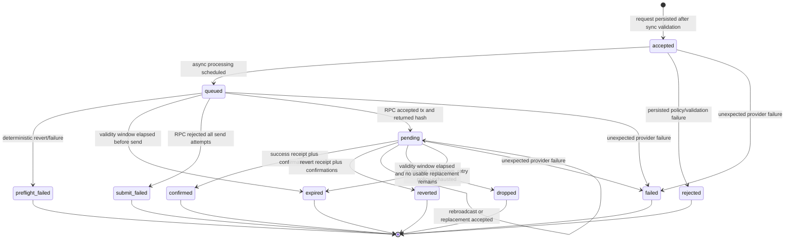

# ClearMacro Provider Backend: Initial High-Level Plan

## Context

This project implements a production-ready backend provider for dapps using the ClearMacro pattern. In this context, a provider is an authorized offchain relayer/executor, identified by a signed provider string such as `macros.superfluid.eth`, not an RPC provider.

Users sign EIP-712 ClearMacro payloads. The provider validates and relays those payloads to `ClearMacroForwarderV1`, which verifies signatures, enforces provider authorization, checks nonce and validity windows, and executes Superfluid batch operations as the signer. `ClearMacroForwarderV1WithPermit2` is understood by the design, but Permit2 execution is not part of the initial implementation unless explicitly enabled in a later milestone.

## First Iteration Scope

The first production iteration should include:

- API needed by dapps to submit and inspect ClearMacro relay requests.
- Robust transaction processing across all expected corner cases.
- Prometheus/Grafana-compatible observability for monitoring and alerting.
- A simple registry mechanism for deciding which requests to relay, initially static config.
- One service instance supporting all chains with Superfluid deployments from Superfluid metadata.
- A well-defined, persisted transaction lifecycle from API request through all final states.
- Full auditability of request validation, transaction attempts, hashes, receipts, retries, replacements, errors, and terminal outcomes.
- Extensive tests covering API, validation, transaction manager behavior, RPC failures, gas failures, reverts, dropped transactions, and downtime/recovery.

The relayer account is assumed to be exclusively owned by this application, so no external nonce interference is expected.

Throughput must not be limited by confirmation speed. The service must be able to keep multiple transactions in flight per chain/account and submit more than one transaction per block.

## Architecture

Build this as a durable multi-chain transaction relayer with a ClearMacro-specific validation and API layer on top.

Core components:

- API server: accepts relay requests, returns request and transaction status, serves OpenAPI docs, and exposes Prometheus metrics.
- Registry: static config initially, mapping allowed chains, forwarders, macro contracts, provider strings, and optional dapp/API credentials.
- Persistent job store: canonical source of truth for request state, validation results, transaction attempts, receipts, and errors.
- Chain workers: one worker lane per chain/account, responsible for queueing, local nonce reservation, signing, submission, and monitoring.
- Transaction manager: owns gas estimation, nonce allocation, signing, send retries, replacement transactions, receipt polling, dropped detection, and finalization.
- Observability layer: metrics, structured logs, health checks, and readiness checks.

## API Shape

Keep the public API small and idiomatic. The API must use one canonical schema source for runtime validation and OpenAPI generation.

- `POST /v1/relay`: submit a signed ClearMacro relay request.
- `GET /v1/requests/{id}`: inspect request lifecycle state and audit-relevant details.
- `GET /v1/capabilities`: expose supported chains, forwarders, macro contracts, and provider identifiers.
- `GET /healthz`: liveness check.
- `GET /readyz`: readiness check.
- `GET /metrics`: Prometheus metrics.

### Shared API Conventions

Primitive formats:

- `Address`: lowercase or checksum EVM address string matching `^0x[0-9a-fA-F]{40}$`.
- `Bytes`: hex string matching `^0x([0-9a-fA-F]{2})*$`.
- `Bytes32`: hex string matching `^0x[0-9a-fA-F]{64}$`.
- `UintString`: non-negative base-10 integer encoded as a string. Use this for all uint256-like values.
- `ChainId`: positive integer. Must match a configured Superfluid deployment.
- `RequestId`: server-generated opaque id. UUIDv7 is preferred.
- `DateTime`: RFC 3339 timestamp string.

Request headers:

- `Content-Type: application/json` is required for JSON requests.
- `Idempotency-Key` is optional on `POST /v1/relay`. If present, the same key and same authenticated client must return the original request instead of creating a duplicate. If the key is reused with a different body, return `409 IDEMPOTENCY_CONFLICT`.
- `Authorization` is optional for the first iteration if the registry is open. If enabled, use `Authorization: Bearer <token>` and map the token to a dapp/client id.

Successful responses return their direct schema, not a generic envelope. Errors always use the common error response.

### Common Error Response

```json
{
  "error": {
    "code": "VALIDATION_ERROR",
    "message": "Request body is invalid.",
    "requestId": "018f2f2c-7c66-7b57-a9e1-ef0d95b51d10",
    "details": {
      "field": "chainId",
      "reason": "Unsupported chain id."
    }
  }
}
```

Fields:

- `error.code`: stable machine-readable error code.
- `error.message`: human-readable summary. Do not rely on this for program logic.
- `error.requestId`: server request id for support/debugging. This is not necessarily a relay request id if validation failed before persistence.
- `error.details`: optional structured context. Must not contain secrets.

### Error Codes

| HTTP | Code | Meaning |
| --- | --- | --- |
| 400 | `VALIDATION_ERROR` | JSON shape, hex format, enum, or required field validation failed. |
| 400 | `UNSUPPORTED_RELAY_KIND` | `kind` is unknown or not enabled. |
| 400 | `INVALID_CLEAR_MACRO_PAYLOAD` | `params` cannot be decoded as the expected ClearMacro payload or fails local consistency checks. |
| 400 | `INVALID_PERMIT2_PAYLOAD` | Permit2 payload is malformed or inconsistent with the ClearMacro payload. |
| 401 | `UNAUTHORIZED` | Missing or invalid API credential. |
| 403 | `CLIENT_NOT_ALLOWED` | Authenticated client is not allowed to use the requested chain/macro/provider. |
| 403 | `CHAIN_NOT_ALLOWED` | Chain is known but disabled by registry policy. |
| 403 | `MACRO_NOT_ALLOWED` | Macro contract is not allowed by registry policy. |
| 403 | `PROVIDER_NOT_ALLOWED` | Provider string is not allowed by registry policy. |
| 404 | `REQUEST_NOT_FOUND` | Relay request id does not exist or is not visible to the caller. |
| 409 | `IDEMPOTENCY_CONFLICT` | `Idempotency-Key` was reused with a different body. |
| 409 | `DUPLICATE_REQUEST` | The same semantic relay request has already been accepted. |
| 422 | `SIGNATURE_INVALID` | Local signature validation failed. |
| 422 | `CLEAR_MACRO_EXPIRED` | `validBefore` is non-zero and already elapsed. |
| 422 | `CLEAR_MACRO_NOT_YET_VALID` | `validAfter` is in the future and delayed execution is disabled by policy. |
| 422 | `NONCE_ALREADY_USED` | The ClearMacro nonce is already consumed onchain or known terminal in provider state. |
| 422 | `SIMULATION_REVERTED` | Preflight `eth_call`/simulation indicates the transaction would revert. |
| 429 | `RATE_LIMITED` | Client or global rate limit exceeded. |
| 503 | `CHAIN_UNAVAILABLE` | No healthy RPC is available for the requested chain. |
| 503 | `PROVIDER_NOT_READY` | Service is live but cannot accept relay work. |
| 500 | `INTERNAL_ERROR` | Unexpected server error. |

Accepted requests that later fail transaction processing do not use HTTP errors. They transition to a terminal lifecycle state visible via `GET /v1/requests/{id}`.

### `POST /v1/relay`

Submits a ClearMacro request for relaying. Returns `202 Accepted` once the request passes synchronous validation and is persisted. It does not wait for transaction submission or confirmation.

v1 implementation scope is `kind: "clearMacroV1"`, explicitly matching `ClearMacroForwarderV1`. The `permit2ClearMacroV1` schema is documented so the API shape can evolve without redesign, but requests of that kind should return `400 UNSUPPORTED_RELAY_KIND` until the Permit2 milestone is explicitly implemented and enabled by registry policy.

Request schema:

```ts
type RelayRequest = ClearMacroRelayRequest | Permit2ClearMacroRelayRequest;

type ClearMacroRelayRequest = {
  kind: "clearMacroV1";
  chainId: ChainId;
  forwarder: Address;
  macro: Address;
  signer: Address;
  params: Bytes;
  signature: Bytes;
  msgValue?: UintString;
  clientRequestId?: string;
  metadata?: Record<string, string>;
};

type Permit2ClearMacroRelayRequest = {
  kind: "permit2ClearMacroV1";
  chainId: ChainId;
  forwarder: Address;
  macro: Address;
  params: Bytes;
  permit2: Permit2MacroParams;
  msgValue?: UintString;
  clientRequestId?: string;
  metadata?: Record<string, string>;
};

type Permit2MacroParams = {
  permit: PermitTransferFrom;
  owner: Address;
  witness: Bytes32;
  witnessTypeString: string;
  signature: Bytes;
  spender: Address;
  upgradeSuperToken: Address;
};

type PermitTransferFrom = {
  permitted: TokenPermissions;
  nonce: UintString;
  deadline: UintString;
};

type TokenPermissions = {
  token: Address;
  amount: UintString;
};
```

Validation rules:

- `forwarder` must be the configured ClearMacro forwarder for `chainId` and `kind`.
- `macro` must match `payload.security.macroContract` decoded from `params`.
- `payload.security.provider` must be allowed by registry policy.
- `payload.security.provider` must not be `self`; this provider backend relays only provider-authorized requests.
- `payload.security.validBefore` must be zero or greater than current time.
- If delayed execution is disabled, `payload.security.validAfter` must be less than or equal to current time.
- For `clearMacroV1`, EOA signatures must be validated locally against `forwarder.getDigest(macro, params)`. For ERC-1271 signers, rely on preflight/simulation and the forwarder's onchain validation rather than duplicating all contract-wallet logic locally in v1.
- For `permit2ClearMacroV1`, once implemented, the signer is `permit2.owner`. The Permit2 signature must be locally validated where practical, and `permit2.witness` must equal `forwarder.getPermit2WitnessStructHash(macro, params, permit2.upgradeSuperToken)`.
- `params` is the ABI-encoded `IClearMacroForwarderV1.Payload`.
- `msgValue` defaults to `"0"`.
- `metadata` is for client correlation only. It must not affect validation, signing, transaction construction, or idempotency unless explicitly configured later.

Success response schema:

```ts
type RelayAcceptedResponse = {
  requestId: RequestId;
  status: RequestState;
  chainId: ChainId;
  kind: "clearMacroV1" | "permit2ClearMacroV1";
  createdAt: DateTime;
  updatedAt: DateTime;
  statusUrl: string;
};
```

Example response:

```json
{
  "requestId": "018f2f2c-7c66-7b57-a9e1-ef0d95b51d10",
  "status": "accepted",
  "chainId": 8453,
  "kind": "clearMacroV1",
  "createdAt": "2026-04-28T12:00:00.000Z",
  "updatedAt": "2026-04-28T12:00:00.000Z",
  "statusUrl": "/v1/requests/018f2f2c-7c66-7b57-a9e1-ef0d95b51d10"
}
```

Possible errors: `400`, `401`, `403`, `409`, `422`, `429`, `503`, `500` using the common error response.

### `GET /v1/requests/{id}`

Returns the current state and audit summary for a relay request. Internal audit events are excluded by default. Add `?include=events` to include them for debugging or support workflows.

Response schema:

```ts
type RelayRequestStatusResponse = {
  request: RelayRequestRecord;
  attempts: TransactionAttemptRecord[];
  events?: AuditEventRecord[];
};

type RelayRequestRecord = {
  id: RequestId;
  clientRequestId?: string;
  idempotencyKey?: string;
  kind: "clearMacroV1" | "permit2ClearMacroV1";
  state: RequestState;
  terminal: boolean;
  chainId: ChainId;
  forwarder: Address;
  macro: Address;
  signer: Address;
  provider: string;
  clearMacroNonce: UintString;
  validAfter: UintString;
  validBefore: UintString;
  msgValue: UintString;
  createdAt: DateTime;
  updatedAt: DateTime;
  terminalAt?: DateTime;
  lastError?: RequestErrorSummary;
  currentTxHash?: Bytes32;
  requiredConfirmations?: number;
  confirmationDepth?: number;
};

type RequestErrorSummary = {
  code: string;
  message: string;
  details?: Record<string, unknown>;
  occurredAt: DateTime;
};

type TransactionAttemptRecord = {
  attemptId: string;
  requestId: RequestId;
  attemptNumber: number;
  chainId: ChainId;
  nonce: UintString;
  txHash?: Bytes32;
  state: AttemptState;
  replacementOfAttemptId?: string;
  gasLimit?: UintString;
  maxFeePerGas?: UintString;
  maxPriorityFeePerGas?: UintString;
  gasPrice?: UintString;
  submittedAt?: DateTime;
  firstSeenPendingAt?: DateTime;
  confirmedAt?: DateTime;
  blockNumber?: UintString;
  blockHash?: Bytes32;
  transactionIndex?: number;
  effectiveGasPrice?: UintString;
  gasUsed?: UintString;
  receiptStatus?: "success" | "reverted";
  error?: RequestErrorSummary;
};

type AuditEventRecord = {
  eventId: string;
  requestId: RequestId;
  attemptId?: string;
  type: AuditEventType;
  reason: string;
  actor: "api" | "validator" | "scheduler" | "chainWorker" | "txManager" | "receiptWatcher" | "recovery";
  details?: Record<string, unknown>;
  createdAt: DateTime;
};

type RequestState =
  | "accepted"
  | "queued"
  | "preflight_failed"
  | "submit_failed"
  | "pending"
  | "confirmed"
  | "reverted"
  | "dropped"
  | "expired"
  | "rejected"
  | "failed";

type AttemptState =
  | "created"
  | "signed"
  | "send_failed"
  | "pending"
  | "replaced"
  | "confirmed"
  | "reverted"
  | "dropped"
  | "abandoned";

type AuditEventType =
  | "request_accepted"
  | "request_rejected"
  | "preflight_started"
  | "preflight_failed"
  | "preflight_succeeded"
  | "queued"
  | "nonce_reserved"
  | "tx_built"
  | "tx_signed"
  | "send_started"
  | "send_rejected"
  | "send_accepted"
  | "rebroadcasted"
  | "replacement_signed"
  | "replacement_accepted"
  | "receipt_seen"
  | "confirmation_depth_updated"
  | "finalized"
  | "dropped"
  | "expired"
  | "failed";
```

Possible errors: `401`, `404 REQUEST_NOT_FOUND`, `429`, `500`.

### `GET /v1/capabilities`

Returns the currently configured relay capabilities. This is registry-derived and should be safe to cache briefly.

Response schema:

```ts
type CapabilitiesResponse = {
  service: {
    name: string;
    version: string;
    providerAddress: Address;
  };
  chains: ChainCapability[];
};

type ChainCapability = {
  chainId: ChainId;
  name: string;
  enabled: boolean;
  superfluidHost: Address;
  forwarders: {
    clearMacroV1?: Address;
    permit2ClearMacroV1?: Address;
  };
  providers: string[];
  macros: MacroCapability[];
};

type MacroCapability = {
  address: Address;
  name?: string;
  enabled: boolean;
  supportedKinds: ("clearMacroV1" | "permit2ClearMacroV1")[];
};
```

Possible errors: `500`.

### `GET /healthz`

Returns `200 OK` if the process is alive.

Response schema:

```ts
type HealthResponse = {
  status: "ok";
  time: DateTime;
};
```

### `GET /readyz`

Returns `200 OK` only if the service can accept relay work. Return `503 PROVIDER_NOT_READY` if required dependencies are unavailable.

Response schema:

```ts
type ReadinessResponse = {
  status: "ready" | "not_ready";
  time: DateTime;
  database: "ok" | "error";
  signer: "ok" | "error";
  chains: Record<string, "ok" | "degraded" | "error">;
};
```

### `GET /metrics`

Returns Prometheus text format, not JSON.

## Request And Transaction Lifecycle

The lifecycle must be explicit, persisted, and auditable without exposing internal local bookkeeping as API-visible states. Request state is separate from transaction attempt state. A relay request may have zero, one, or many transaction attempts.

Public request states should represent points where the request can wait on a remote system or meaningful async work. Purely local steps, such as validation completed, nonce reserved, transaction built, and transaction signed, must be persisted as audit events but should not be API-visible request states.

EVM transaction handling is two-phased and the state machine must preserve that boundary:

- Submission phase: the provider sends a signed raw transaction to an RPC. The RPC either rejects it immediately or accepts it and returns a transaction hash.
- Inclusion/finality phase: once accepted, the transaction is pending until a receipt is observed and the configured confirmation threshold is reached, or until it is considered dropped/replaced/expired by policy.

### Request States

| State | Terminal | Meaning |
| --- | --- | --- |
| `accepted` | no | Request passed synchronous validation and policy checks and is persisted. API returns `202` from this state. |
| `queued` | no | Request is waiting for worker capacity, chain health, `validAfter`, or preflight execution. |
| `preflight_failed` | yes | Deterministic preflight showed the transaction cannot succeed, usually revert or impossible gas estimation. |
| `submit_failed` | yes | No transaction was accepted by RPC after retry policy. No tx hash exists for the terminal attempt. |
| `pending` | no | At least one RPC accepted the transaction and returned a tx hash; receipt/finality is not complete yet. |
| `confirmed` | yes | Receipt status is success and required confirmations were reached. |
| `reverted` | yes | Receipt status is reverted and required confirmations were reached. |
| `dropped` | yes | Transaction is no longer known by RPC nodes and replacement/retry policy is exhausted. |
| `expired` | yes | ClearMacro validity window expired before successful inclusion. |
| `rejected` | yes | Request failed validation or registry policy after persistence. Most validation failures should be returned synchronously and not persisted. |
| `failed` | yes | Non-recoverable provider failure after acceptance. This should be rare and alert-worthy. |

Terminal states are final. The implementation must never transition out of a terminal request state.

### Attempt States

| State | Terminal | Meaning |
| --- | --- | --- |
| `created` | no | Attempt row was created for a reserved nonce. |
| `signed` | no | Raw signed transaction bytes are persisted. |
| `send_failed` | no | Send attempt failed before RPC acceptance. Retry may reuse the same signed raw tx or create a replacement according to policy. |
| `pending` | no | RPC accepted the raw transaction and returned a tx hash, or returned already-known for the same hash. |
| `replaced` | yes | Another attempt with the same nonce superseded this attempt. |
| `confirmed` | yes | Receipt status is success and required confirmations were reached. |
| `reverted` | yes | Receipt status is reverted and required confirmations were reached. |
| `dropped` | yes | This attempt is not known by RPC nodes and will not be retried. |
| `abandoned` | yes | Attempt is intentionally ignored because the parent request reached a terminal state. |

### State Diagram



### Required Transition Rules

- Every public state transition must insert an audit event in the same database transaction as the state update.
- Every audit event must have a `reason` string and `actor` enum.
- All RPC errors must be normalized before being stored in `details`.
- Local steps must be persisted as audit events, not exposed as public request states.
- A request must not enter `pending` unless an RPC returned a tx hash or equivalent already-known response for the same raw transaction.
- A request must not enter `confirmed` or `reverted` unless a receipt is persisted and the configured confirmation threshold is reached.
- A request may enter `dropped` only after checking all configured RPC providers according to policy and exhausting rebroadcast/replacement options.
- A request may enter `expired` when `validBefore` elapsed before final inclusion and no already-submitted transaction can still succeed under policy.
- If a replacement transaction is created, the previous attempt must become `replaced`, and the new attempt must reference `replacementOfAttemptId`.
- If the process restarts, recovery must rebuild in-memory scheduling from persisted non-terminal requests and attempts.

### Internal Audit Events

The implementation must persist enough internal events to reconstruct what happened, but these events should not complicate the main API state machine.

Important internal events include:

- `request_accepted`: synchronous validation and policy checks passed.
- `preflight_started`, `preflight_succeeded`, `preflight_failed`: optional simulation/preflight result.
- `queued`: request became eligible for a chain worker.
- `nonce_reserved`: durable local nonce reservation committed.
- `tx_built`: transaction request constructed.
- `tx_signed`: raw signed transaction bytes persisted.
- `send_started`: `eth_sendRawTransaction` call started.
- `send_rejected`: RPC rejected the send before returning a tx hash.
- `send_accepted`: RPC accepted the transaction and returned a tx hash.
- `rebroadcasted`: same raw transaction was sent again because RPC state was uncertain.
- `replacement_signed`, `replacement_accepted`: replacement transaction for the same nonce was created/accepted.
- `receipt_seen`: transaction receipt observed.
- `confirmation_depth_updated`: receipt confirmation depth changed.
- `finalized`: terminal state reached.

## Transaction Processing Requirements

The transaction manager must support:

- Local durable nonce reservation per chain/account.
- Multiple pending transactions per chain/account.
- Recovery after process restart without losing nonce/account state.
- Gas estimation before submission, with chain-specific policy and safety multipliers.
- Classification of RPC errors into retryable, replaceable, rejected, and terminal categories.
- Explicit two-phase RPC handling: `eth_sendRawTransaction` acceptance/rejection first, then receipt and confirmation tracking.
- Rebroadcasting known raw transactions when RPC state is uncertain.
- Replacement transactions with bumped fees for stuck pending transactions.
- Receipt polling and finalization for both success and revert after chain-specific confirmation thresholds.
- Dropped transaction detection using receipt polling plus transaction lookup.
- Expiry handling for ClearMacro validity windows.
- Clear distinction between preflight validation failures, transaction submission failures, onchain reverts, dropped transactions, and infrastructure failures.

Use mature EVM libraries for transaction primitives and RPC calls, but own the durable lifecycle. For a TypeScript implementation, `viem` is a good default because it exposes explicit `sendRawTransaction`, `getTransactionReceipt`, `getTransaction`, fee estimation, and simulation primitives without forcing a single blocking send-and-wait abstraction. Avoid making `waitForTransactionReceipt` the core state machine; it may be used internally only when its intermediate outcomes are still persisted correctly.

## Observability

Expose Prometheus metrics for at least:

- Request intake count by chain, dapp, macro, and result.
- Validation failures by reason.
- Queue depth by chain.
- Pending transaction count by chain and nonce range.
- Transaction attempts by chain and outcome.
- Send/retry/replacement counts by error class.
- Confirmation latency and total request latency.
- Reverts by macro/chain.
- RPC health, latency, and error rate.
- Gas estimate, submitted fee, effective fee, and replacement bump behavior.
- Nonce gaps or stuck nonce alerts.

Use structured logs with request id, chain id, nonce, tx hash, macro contract, signer, provider string, and attempt id where applicable.

## Foundry Broadcast Lessons

Foundry's broadcast implementation is useful as a reference for transaction handling patterns:

- Persist/checkpoint immediately after a transaction is submitted.
- On resume, first inspect already-pending transactions before sending more.
- Detect dropped transactions using receipt polling combined with transaction lookup.
- Send concurrently when one sender and chain behavior allow it, but fall back to sequential behavior where necessary.
- Retry transient send errors, while preserving the original error for diagnostics.
- Re-estimate gas close to broadcast on chains/RPCs where gas estimation is chain-specific or unreliable.

For this backend, these ideas need to become durable long-running service behavior rather than CLI script behavior.

## Testing Strategy

The test suite must cover deterministic business logic, realistic local execution, chain compatibility, and actual production RPC behavior. No single test environment is sufficient.

### Unit Tests With Mocked RPC

Use mocked RPC tests for transaction-manager and API edge cases that are hard or impossible to force reliably on a local chain.

Coverage targets:

- API schema validation, error responses, and idempotency behavior.
- Registry policy decisions for chain, macro, provider, and client authorization.
- RPC rejection of `eth_sendRawTransaction` before a tx hash is returned.
- Retryable RPC failures, timeouts, connection errors, malformed responses, and rate limits.
- Common send errors such as `already known`, `nonce too low`, `replacement transaction underpriced`, insufficient funds, and gas price errors.
- Gas estimation failure and simulation revert classification.
- Receipt missing while transaction is still known.
- Receipt missing and transaction unknown across all configured RPCs.
- Rebroadcast and replacement policy.
- Durable nonce reservation and restart/recovery from persisted non-terminal states.
- Metrics and structured log emission for key paths.

Suggested tooling:

- Vitest or the Node test runner.
- `viem` mocked/custom transport.
- Disposable PostgreSQL using Testcontainers or an equivalent local test database.

### Local Dev Chain Integration Tests

Use a local dev chain for realistic end-to-end behavior with actual signing, nonce usage, contract execution, receipts, and reverts.

Coverage targets:

- ClearMacro relay success through `ClearMacroForwarderV1`.
- Permit2 relay path only after the Permit2 milestone is explicitly implemented.
- Onchain revert handling.
- Multiple in-flight transactions from the same relayer account.
- Validity window behavior.
- Confirmation tracking with configurable confirmation threshold.
- Backend restart while requests are queued or pending.
- Database state, attempts, and audit events after success and failure.

Suggested tooling:

- Anvil.
- Minimal deployed Superfluid/ClearMacro test setup, reusing contracts and examples from `ethereum-contracts` where practical.
- Real PostgreSQL test database.

### Fork Compatibility Tests

Use fork tests sparingly for compatibility with real deployed Superfluid metadata and chain-specific behavior. These tests are slower and more brittle than local-chain tests, so they should be a focused compatibility suite rather than the main correctness suite.

Coverage targets:

- Superfluid metadata resolves the expected host and forwarder addresses.
- Configured ClearMacro forwarders exist on representative chains. Permit2 addresses should be checked only after the Permit2 milestone is implemented.
- Chain-specific gas estimation and fee fields work against forked state.
- Calls/simulations against real deployed contracts behave as expected.

Suggested tooling:

- Anvil fork mode against selected chains.
- Representative chains selected by behavior, not popularity, such as a normal EIP-1559 L2, an Arbitrum-style chain, and a mainnet-like chain if needed.

### Manual Production-Network Smoke Tests

Fork tests are not enough because they run against a different node implementation and cannot fully reproduce production RPC behavior, mempool policy, propagation, fee market behavior, rate limits, or finality characteristics.

Provide a manually triggered production-network smoke test suite. It must not run in normal CI.

Coverage targets:

- Real RPC acceptance/rejection behavior for signed transactions.
- Real receipt and confirmation tracking.
- Real gas estimation and fee behavior.
- Provider account nonce handling with multiple in-flight transactions.
- Real Superfluid deployment metadata and configured forwarder addresses.
- Basic monitoring signals during live traffic.

Safety requirements:

- Run only on explicitly selected chains and only when an operator opts in.
- Use a dedicated funded relayer account and dedicated test signer accounts.
- Use tiny-value transactions and safe test macros where possible.
- Require environment variables or CLI flags such as `RUN_PROD_SMOKE_TESTS=true`, target chain ids, RPC URLs, and account configuration.
- Print expected maximum spend before running and require explicit confirmation unless running in a controlled non-interactive ops environment.
- Never run from pull-request CI.
- Persist and report request ids, tx hashes, chain ids, gas spent, and final states.

The implementation should make these tests easy to run manually before production releases and after RPC/provider configuration changes.

## Initial Implementation Preference

Prefer a simple TypeScript backend unless later constraints suggest otherwise.

A pragmatic starting stack would be:

- Fastify for HTTP.
- TypeBox as the single schema source for runtime validation and OpenAPI generation.
- PostgreSQL for durable lifecycle/audit state.
- Prometheus metrics endpoint for monitoring.
- A small chain-worker/transaction-manager module rather than an external queue system initially, unless persistence/retry requirements make a queue useful.

Keep the design minimal, explicit, and testable. Avoid premature abstractions, but treat transaction state, nonce management, and auditability as core correctness concerns from the start.
