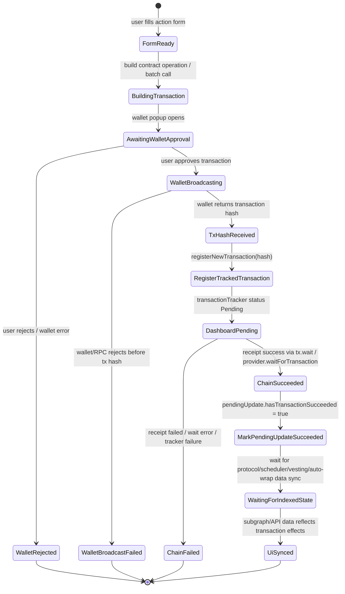
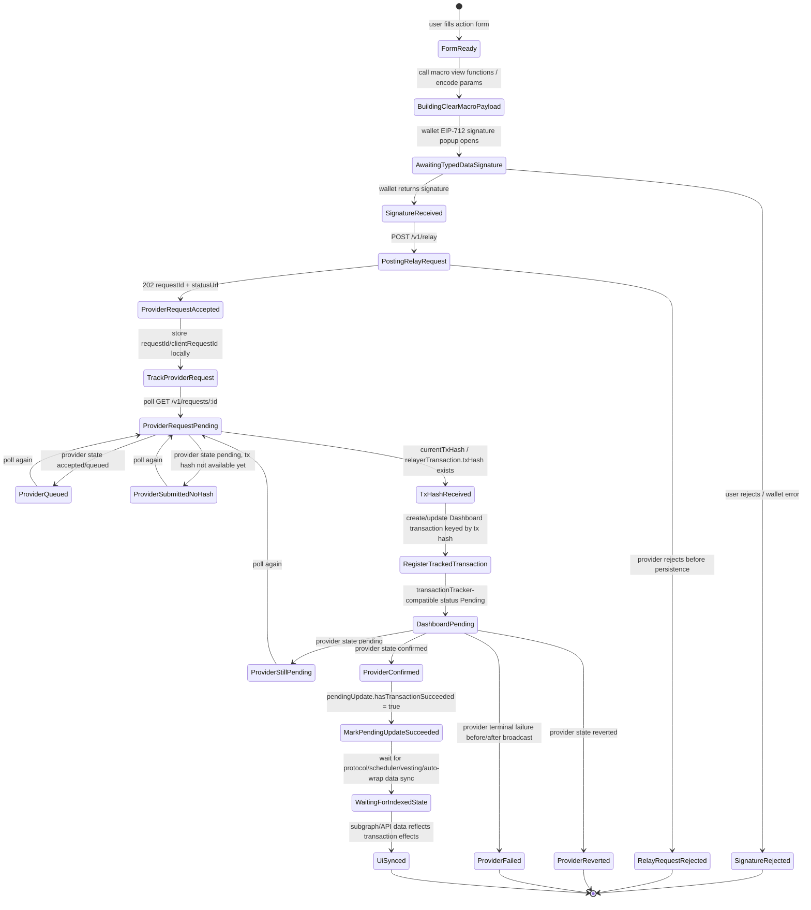

# Dashboard Transaction State Machines

> **Note:** Conceptual mapping for Dashboard UX. Align public state names with [`simplified-dapp-facing-relay-api.md`](./simplified-dapp-facing-relay-api.md) (`pending`, `submitted`, … — no `accepted` / `included` in the provider API).

This document compares the Dashboard dapp transaction state machine today with the state machine it would need when migrating transaction execution to `clearmacro-provider`.

## 1. Dashboard Today: Connected Wallet Broadcasts The Transaction

Current Dashboard assumptions:

- The mutation succeeds only after the connected wallet returns a transaction hash.
- The transaction hash is the primary local ID for `transactionTracker` and most `pendingUpdates`.
- Once a hash exists, Dashboard can show the transaction drawer item and explorer link immediately.
- Chain success is detected by `tx.wait()` / `provider.waitForTransaction(hash)`.
- After chain success, Dashboard keeps optimistic UI state until the relevant indexed data source catches up.

## 2. Dashboard With clearmacro-provider Relay

Additional Dashboard states introduced by provider relaying:

- `TrackProviderRequest`: Dashboard must persist a provider request before a transaction hash exists.
- `ProviderQueued`: the provider accepted the request, but the worker has not submitted it to the relayer yet.
- `ProviderSubmittedNoHash`: the relayer accepted the transaction intent, but no RPC transaction hash is available yet.
- `TxHashReceived`: the point where Dashboard can bridge into its existing hash-keyed transaction drawer and pending-update model.

Key difference:

- Today, Dashboard moves from wallet approval directly to a tx-hash-based local transaction.
- With `clearmacro-provider`, Dashboard first needs a request-ID-based tracker, then later attaches or creates the normal tx-hash-based transaction once the provider exposes a hash.
